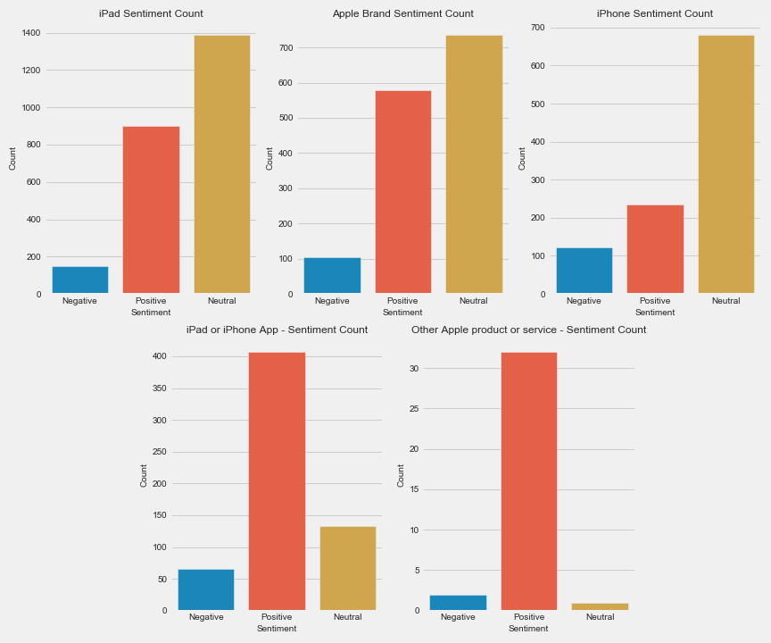
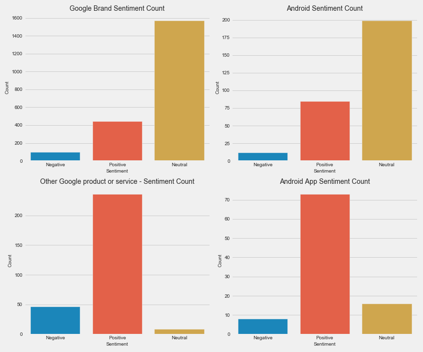
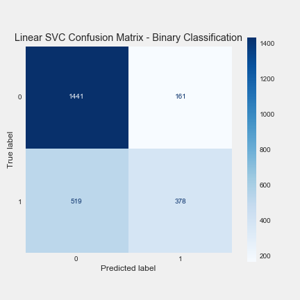

# Sentiment Analysis of Tweets using NLP

In today's technologically driven society, social media (especially Twitter) often acts as a central repository for thoughts, feelings, and opinions. Fortunately, technology has also provided a means by which we can attempt to evaluate or analyze some of those opinions. Through the use of machine learning and natural language processing there exists a methodology where we can look at a collection of words and determine sentiment. The obvious benefit here is that social media is used by hundreds of millions of people each day. According to a report from oberlo.com, Twitter has 330 million monthly active users and 145 million daily active users. With that many users, it would be a near impossible (and immensely expensive) task to have people read through and interpret that many tweets. However, with the appropriate amount of computing power and a dataset on which to train and test a model, we can comb through thousands of tweets in a matter of minutes and evaluate public opinion on our topic of choice.

In this notebook, I will be building a model that will attempt to determine the sentiment of the tweet. The dataset I used for this project can be found here. The tweets have already been labeled as having "positive emotion", "negative emotion", or "no emotion towards a brand or product".

## Business Understanding
Twitter is the online marketplace for thoughts, feelings, and opinions. We care about what other people have to say and consider our peers opinions when it comes to making purchasing decisions.

Per Twitter market research - 3 in 4 people look to Twitter users for advice and 9 in 10 people have changed their opinion because of Twitter advice!

## Exploratory Data Analysis

We measured the sentiment count by each brand/product to see if there was anything that was overwhemingly positive or negative.

We also took a look at WordClouds for each of the three classes to see which words/bigrams were most common and which were most unique.

Positive Words and Bigrams
![images/pos_wordcloud.png]

Negative Words and Bigrams
![images/neg_wordcloud.png]

Neutral Words and Bigrams
![images/neu_wordcloud.png]

## Modeling

We trained and tested models that predicted sentiment based on 3 classes (positive, negative, and neutral) as well as just 2 classes (positive vs negative/neutral).

Binary classification was about 6% more accurate overall than classifying with 3 categories. Support vector machines were the best performing model, although they did have much greater run times compared to Naive Bayes and Random Forests. 

The best accuracy score was 72.7% using a support vector machine with a linear kernel. That model had 90% recall on negative/neutral tweets and 70% precision on positive tweets.

## Conlusion

Our best model had a 72.7% overall accuracy with 90% recall on negative/neutral tweets and 70% precision on positive tweets.

The best performing model was a support vector machine with a linear kernel. Although it was the best performing model, the major drawback to the support vector machine it the computation time. Large tech companies definitely have the resources such that they could use an SVM and have it make predictions in a reasonable amount of time, however with tweets now having a maximum character length of 280 characters other, more efficient model architectures should be explored.

### Recommendations

1. When releasing a new hardware, make sure there is some type of accompanying software. For both Apple and Google, the tweets about services and mobile apps were overwhemingly positive. If a good app exists, then that will only provide more incentive to buy your product.

2. Determine ways to guide conversations about your product on social media. Before their next iPhone event, Apple could tweet something along the lines of, "Give us 5 reasons why you're excited for the new iPhone and use the hashtag #TeamiPhone". In this example we have used a word that conveys positive emotion ('excited') and we have also created a readily identifiable token with a hashtag. We also can use a similar message to identify users who may be on the fence. We want to avoid provoking users to make negative tweets but we can ask for feedback by saying something like, "Tell us what improvements you want to see in the next iPhone #iPhoneEvolution". We again have another unique hashtag which should make those tweets easy to identify and also quantify what may lacking in hardware or user experience without asking for negative feedback.

3. It is imperative that when releasing a new product it is both innovative and improves upon the previous version in some way. The word 'battery' shows up as one of the top 20 most negative features and the negative WordCloud also included the bigram "battery life". Cell phones are arguable the most important tool in modern society and mobility is one of the most import features of the cell phone. The convenience of mobility ceases to exist if the phone (or any other mobile device) has to be repeatedly plugged into a wall.

4. Avoid the development of another social network or partnering with existing social networks. Interestingly enough, the word 'twitter' is a top 20 negative feature and the bigrams 'new social' and 'social network' were of moderate significance in the wordcloud based on their size. The optimized model has reinforced what we observed in EDA so at this time is appears that social media should not be on of the app focuses as noted in recommendation #1.

### Future Work

- Developing a script to get tweets from Twitter's API and evaluate those tweets once a certain number of tweets have been collected
  - For example we could have a script that can get tweets centered around a certain topic and evaluate sentiment on those tweets made in a certain time interval or evaluate sentiment on the 100,000 most recent tweets about a subject.
Building a model to evaluate sentiment from other forms of social media

 - Since the pandemic started, Apple had broadcasted all of their events during a livestream on Youtube. It would definitely be helpful to evaluate sentiment for the thousands of comments made during the livestream as well as the subsequent comments made at a later time.

 - Using Named Entity Recognition to create synthetic tweets

 - Building, testing, and training a BERT model to predict sentiment

 - Adding a time series component to see how opinions of brands/products change over time

 - Evaluate engagement metrics (replies, retweets, and likes) for tweets to understand if those features impact sentiment predictability
